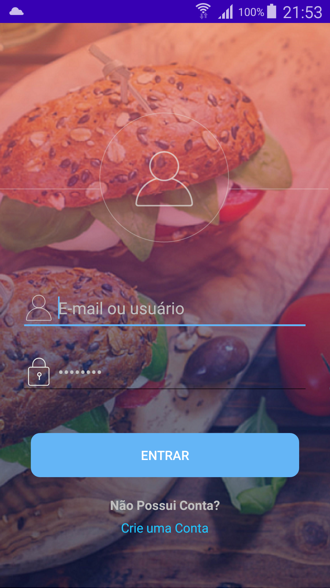
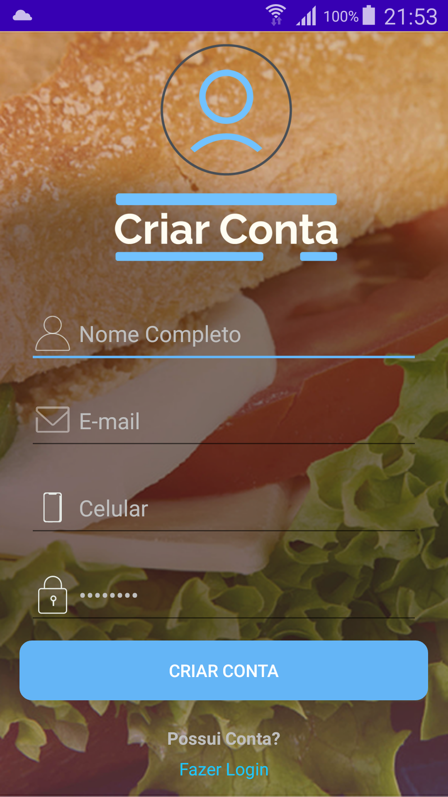
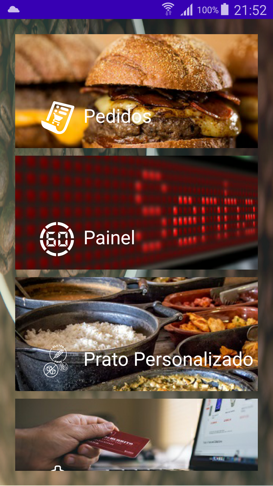
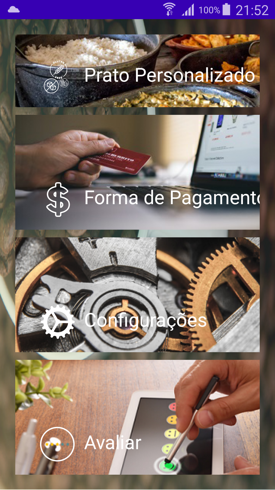
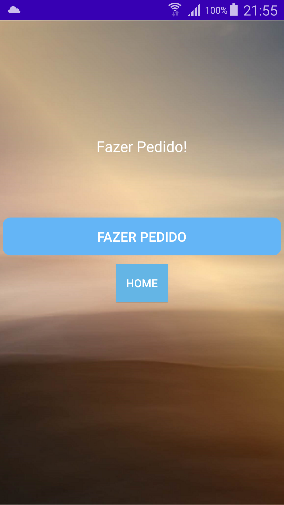

# MacRowFront
Repositório criado para abrigar o Front End feito em Kotlin do projeto MacRow.

<h2>Tela inicial</h2>
 
 O Aplicativo inicia com a tela incial.

<h2>Tela de Login</h2>
  
 Login do App

<h2>Tela de Criação de Conta</h2>
 
 O Aplicativo oferece ao usuário a opção de cadastro.

<h2>Tela do Menu Principal</h2>
  
Menu Principal mostrando as opções

<h2>Tela de Pedidos</h2>
  
Os produtos serão exibidos na tela. [EM BREVE]

